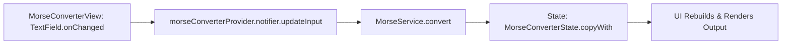
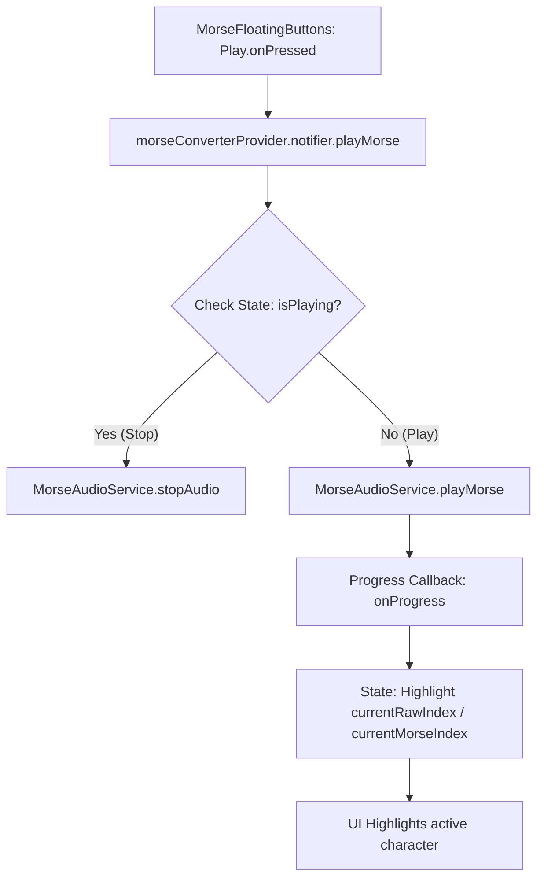

# DotDash

A responsive web application built with Flutter and Riverpod for real-time Morse code conversion, interactive learning, and precise audio playback.

---

## 🚀 Key Features

*   **Dual-Way Real-Time Translation**: Seamlessly convert Text to Morse code and Morse code to Text as you type. Includes input filtering to enforce correct character formats.
*   **Progressive Highlight Tracking**: Visual character-by-character highlight tracking under the active symbol/character as the audio plays.
*   **Interactive Handbook (Morse Book)**: A responsive grid layout of all Morse code letters, numbers, and symbols. Users can click any tile to instantly play and hear its Morse sound.

---

## 🛠️ Architecture & Tech Stack

This project is built following clean architecture principles, separating services, state management, data models, and UI widgets:

### Technical Stack
*   **Framework**: Flutter Web
*   **State Management**: Riverpod 3.0 (using modern `Notifier` and `NotifierProvider` classes)
*   **Audio Core**: `audioplayers` for local assets sound synthesis.
*   **Visual Enhancements**: `flutter_animate` for smooth transitions and `google_fonts` for typography.

### Codebase Organization
```
lib/
├── models/             # Immutable data structures (e.g. MorseConverterState, AppSection)
├── providers/          # Riverpod state controllers and dependency injections
├── screens/            # Screens/Pages (PlatformDecider, MorseConverterView, BookPage, CreditsPage)
├── services/           # Business logic (MorseService) and hardware controls (MorseAudioService)
├── utils/              # Internal utilities (Logger)
└── widgets/            # Reusable components (sidebar, bottombar, pills, custom buttons)
```

---

## ⏱️ Morse Audio Pacing Specifications

Audio timing conforms strictly to the International Morse Code standards:

| Element | Units | Duration (ms) | Description |
| :--- | :--- | :--- | :--- |
| **Base Unit (Dot)** | 1 | 110 ms | Standard dot duration |
| **Dash** | 3 | 330 ms | Standard dash duration |
| **Intra-Element Pause** | 1 | 110 ms | Gap between dots and dashes within a character |
| **Inter-Letter Pause** | 3 | 330 ms | Gap between individual letters |
| **Inter-Word Pause** | 7 | 770 ms | Gap between complete words |

---

## ⚙️ Development & Setup

### Prerequisites
*   Flutter SDK (Targeting SDK environment `^3.9.2`)
*   Google Chrome (or any modern browser supporting HTML5 Audio)

### Getting Started

1.  **Clone the Repository**:
    ```bash
    git clone https://github.com/jydv402/dotdash.git
    cd dotdash
    ```

2.  **Fetch Dependencies**:
    ```bash
    flutter pub get
    ```

3.  **Run the Application locally**:
    ```bash
    flutter run -d chrome
    ```

4.  **Build Production Web Bundle (WASM)**:
    Build the web application using the WebAssembly compiler for optimized execution:
    ```bash
    flutter build web --release --wasm
    ```

### ☁️ Cloudflare Pages Deployment
To deploy this project to Cloudflare Pages:
1. Connect your git repository in the Cloudflare Dashboard.
2. Configure the following build settings:
   * **Framework preset**: `None`
   * **Build command**: `flutter/bin/flutter build web --release --wasm` (or configure your CI to download/use Flutter `^3.9.2`)
   * **Build output directory**: `build/web`

---

## 🔄 Core Flows

### 1. Text-to-Morse Conversion Flow
The UI watches the `morseConverterProvider`. Changes in input text trigger the `MorseConverterNotifier` to fetch translation from `MorseService` and push updates to the UI reactively.



### 2. Audio Playback Flow
The notifier starts the `MorseAudioService`, tracking character indices sequentially and updating the UI state with progress callbacks to highlight the active character.



---

## 📄 License
This project is licensed under the **MIT License**.
